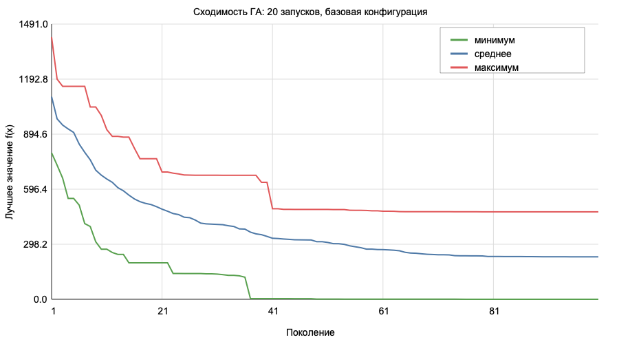
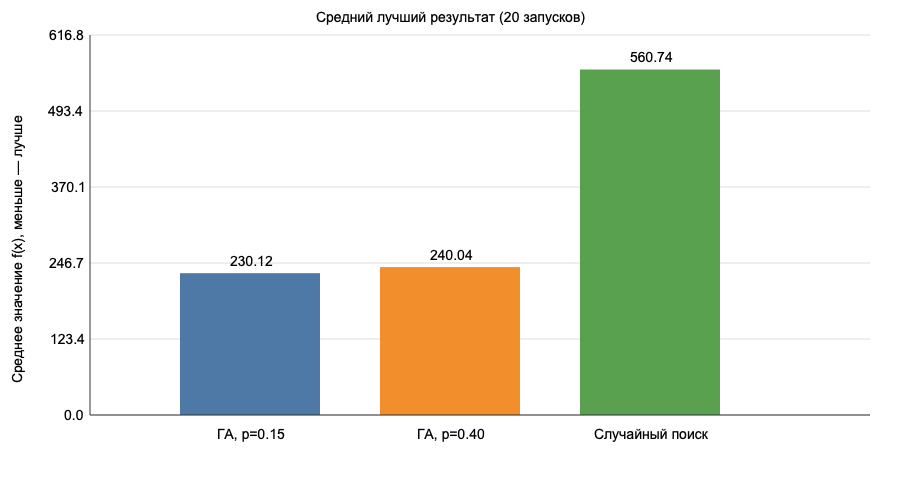

# Отчёт по лабораторной работе № 1

**Дисциплина:** «Эволюционное программирование и генетические алгоритмы»  
**Вариант:** 6  
**Тема:** поиск минимума многомерной функции Швефеля генетическим алгоритмом.

## 1. Постановка задачи

Нужно найти минимум функции Швефеля на ограниченной области. Для варианта 6
размерность равна `d = 5 + (6 mod 6) = 5`.

\[
f(x) = 418.9829 \cdot d - \sum_{i=1}^{d}x_i\sin(\sqrt{|x_i|}),
\qquad x_i \in [-500; 500].
\]

Ищется минимум `f(x)`. Известный глобальный минимум почти равен нулю и
достигается около точки `(420.9687, ..., 420.9687)`.

Функция сложна для случайного и локального поиска: в ней много локальных
минимумов. Если поиск попал в один из них, небольшие изменения координат не
обязательно приведут к лучшей области. Поэтому полезны популяция и мутация,
которые позволяют проверять несколько частей области одновременно.

## 2. Представление решения и ограничения

Особь — список из пяти вещественных чисел: `[x1, x2, x3, x4, x5]`.
Это одновременно генотип и фенотип: дополнительного декодирования не нужно.
Начальная популяция создаётся равномерно в допустимой области.

После скрещивания и мутации каждая координата ограничивается функцией
`clip`: значение меньше `-500` заменяется на `-500`, а больше `500` — на
`500`. Поэтому недопустимые решения не передаются в следующее поколение.

## 3. Использованный генетический алгоритм

```
[Создать начальную популяцию]
              |
              v
[Вычислить f(x) для всех особей]
              |
              v
[Сохранить лучшую особь (элитизм)]
              |
              v
[Турнирный отбор двух родителей]
              |
              v
[Арифметическое скрещивание и мутация]
              |
              v
[Ограничить координаты и оценить потомка]
              |
              v
[Новое поколение готово?] -- нет --> [Турнирный отбор]
              |
             да
              v
[Достигнуто 100 поколений?] -- нет --> [Сохранить элиту]
              |
             да
              v
            [Ответ]
```

- **Отбор:** турнир из трёх случайных особей; выбирается особь с меньшим
  значением функции. Он прост и не требует преобразовывать задачу минимума в
  задачу максимизации фитнеса.
- **Скрещивание:** арифметическое. Для каждой пары родителей выбирается
  случайный вес `a` и получается потомок `a * parent1 + (1 - a) * parent2`.
  Такой оператор естественен для вещественного вектора. Это также выполненное
  дополнительное задание: реализован арифметический кроссовер.
- **Мутация:** для каждой координаты с заданной вероятностью прибавляется
  гауссовское случайное число с нулевым средним и `sigma = 70`.
- **Элитизм:** лучшая особь прошлого поколения без изменений переносится в
  новое. Из-за этого найденный результат не может стать хуже.
- **Остановка:** ровно 100 поколений. В одном запуске выполняется 5901
  вычисление функции: 60 начальных особей и по 59 новых потомков в 99
  следующих поколениях.

## 4. Параметры эксперимента

| Параметр | Базовый ГА | ГА с частой мутацией |
|---|---:|---:|
| Размер популяции | 60 | 60 |
| Число поколений | 100 | 100 |
| Размер турнира | 3 | 3 |
| Вероятность скрещивания | 0.90 | 0.90 |
| Вероятность мутации координаты | 0.15 | 0.40 |
| Масштаб мутации `sigma` | 70 | 70 |
| Бюджет вычислений функции | 5901 | 5901 |

Сравнивались две конфигурации. Изменён только один фактор — вероятность
мутации. Для честного сравнения случайный поиск тоже получил ровно 5901
случайных точек. Выполнено по 20 независимых запусков с seeds от 20261001 до
20261020.

## 5. Результаты

Полные результаты всех 60 запусков и координаты найденных точек находятся в
[results/runs.csv](results/runs.csv). Сводная машиночитаемая таблица —
[results/summary.csv](results/summary.csv).

| Метод | Лучшее | Среднее | Медиана | Ст. отклонение | Худшее |
|---|---:|---:|---:|---:|---:|
| ГА, вероятность мутации 0.15 | 0.0497 | 230.1186 | 236.8851 | 122.2871 | 473.7758 |
| ГА, вероятность мутации 0.40 | 6.2394 | 240.0442 | 239.3098 | 117.5764 | 508.4394 |
| Случайный поиск | 421.2077 | 560.7384 | 542.3882 | 91.0128 | 764.0571 |

Лучший результат базового ГА получен в запуске 10 (`seed = 20261010`):

```
f(x) = 0.049746
x = (421.026699, 420.838362, 420.726686, 421.133756, 420.432443)
```

Он близок к известной оптимальной точке `(420.9687, ..., 420.9687)` и к
теоретическому минимуму 0.

На рисунке показаны минимальная, средняя и максимальная траектории лучшего
значения среди 20 базовых запусков.



Исходные числа для графика находятся в
[results/trajectory.csv](results/trajectory.csv), а векторная версия графика
— [results/convergence.svg](results/convergence.svg).

Сравнение средних лучших результатов:



Векторная версия: [results/comparison.svg](results/comparison.svg).

## 6. Вывод

Базовый генетический алгоритм заметно лучше случайного поиска при одинаковом
числе вычислений функции: средний результат 230.12 против 560.74. Он хотя бы
в одном запуске почти достиг теоретического минимума.

Увеличение вероятности мутации с 0.15 до 0.40 в этой серии не улучшило
средний результат: 240.04 хуже 230.12. Вероятно, слишком частые изменения
координат чаще разрушают удачные комбинации. При этом стандартное отклонение
велико: функция многомодальная, и некоторые запуски остаются около локальных
минимумов. Поэтому результат можно считать хорошим как базовую реализацию и
лучше случайного поиска, но для более устойчивого попадания в глобальный
минимум полезно было бы увеличить бюджет, применить рестарты или адаптивный
масштаб мутации.
